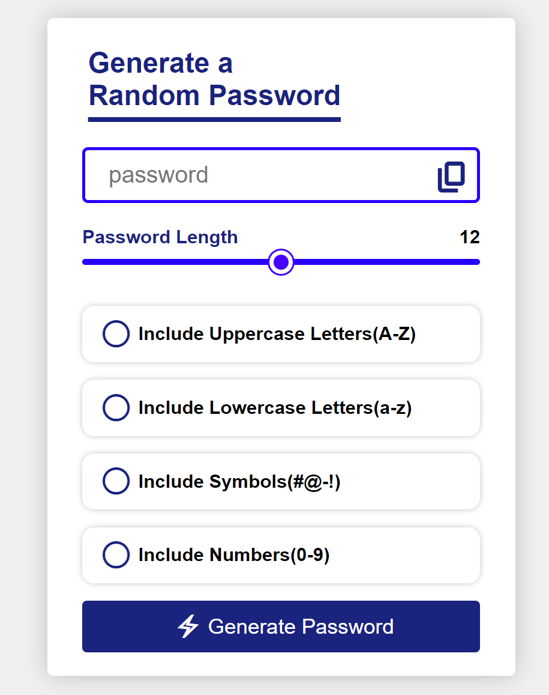

# Random Password Generator

A robust and customizable Random Password Generator app that creates secure passwords based on user-selected criteria. Built with **HTML**, **CSS**, and **JavaScript**, this app allows users to specify the length and types of characters included in the password.

## Features

- **Customizable Length**: Choose the desired length of the password (e.g., 8–20 characters).
- **Character Options**:
  - Include uppercase letters (A-Z)
  - Include lowercase letters (a-z)
  - Include numbers (0-9)
  - Include symbols (e.g., #, @, !, -)
- **Responsive Design**: User-friendly interface that works on all devices.
- **Instant Copy Function**: Quickly copy the generated password to the clipboard (future enhancement).

## Demo

Check out the live demo of the project [here](https://sanskargupta0.github.io/Generate-a-Random-Password/).




## Installation and Setup

1. Clone the repository or download the source code:
    ```bash
    git clone https://github.com/Sanskargupta0/Generate-a-Random-Password.git
    ```

2. Navigate to the project folder:
    ```bash
    cd password-generator
    ```

3. Open `index.html` in your web browser:
    ```bash
    open index.html
    ```

## Usage

1. **Select Password Length**: Adjust the password length slider or input the desired number (default is 12).
2. **Choose Character Options**: Check the boxes for:
   - Uppercase Letters
   - Lowercase Letters
   - Symbols
   - Numbers
3. **Generate Password**: Click the "Generate Password" button to create a new random password.
4. **Copy Password**: Use the copy button (if available) to copy the password to your clipboard.

